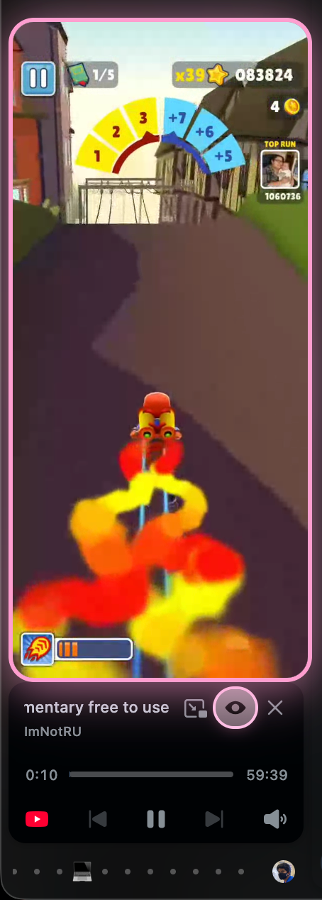
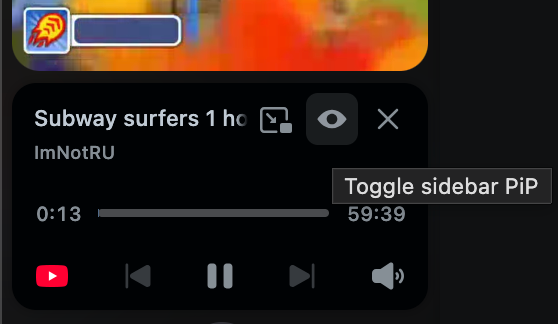

# Zenslop

A [Sine](https://github.com/CosmoCreeper/Sine) mod for [Zen Browser](https://zen-browser.app/) that mirrors the currently playing video into the sidebar, anchored above the media controls.

<!-- HERO IMAGE — full-width screenshot of the sidebar with a video mirrored above the media controls -->
<p align="center">
  
</p>

---

## What it does

This mod hooks into the existing media playback controls and surfaces the video directly above it - so you can continue the doomscroll without dealing with adjusting the position of a separate PiP window or hiding the video altogether.

<!-- DEMO GIF — short loop of starting playback in a tab and the mirror appearing in the sidebar -->
<p align="center">
  
</p>

---

## Installation

> [!NOTE]
> This mod is loaded through [Sine](https://github.com/CosmoCreeper/Sine), Zen's userscript loader. If you're loading user-chrome scripts via a different mechanism, just add this to your chrome folder like you would with other sine mods. 
> 
> Additionally, this mod requires installing Javascript to work, which is disabled by default for unofficial sources in Sine. If you would like to audit the project for malicious code, you can look at the source code in this repository.

1. Visit [about:settings](about:settings) and go to the "Sine Mods" section
2. Click the Settings icon to the right of the Install button, and turn on "Enable installing JS from unofficial sources. (unsafe, use at your own risk)" (see note above if hesitant)
3. Enter `Firebolt9907/Zenslop` into the text input box right under "or, add your own locally from a GitHub repo." and click Install
4. Restart your browser (important!!)

---

## Featured Forks

### Kawaiislop
**bboonstra/Kawaiislop/tree/bugfix**

<p align="center">
  
</p>

---

## The Technical Stuff

The mod runs in three pieces that bridge Firefox's e10s process boundary:

| File | Process | Responsibility |
| --- | --- | --- |
| `main.uc.js` | chrome | Injects the floating video container into the sidebar, registers the `JSWindowActor`, and exposes `window.ZenPiPController`. |
| `content-actor.js` | content | Watches `playing` / `pause` / `volumechange` on `<video>` elements, captures the stream via `captureStream()`, and forwards it through a same-process `RTCPeerConnection`. |
| `parent-actor.js` | chrome | Receives the WebRTC offer, answers it, and hands the resulting `MediaStream` to `ZenPiPController.showVideo()`. |

### Why WebRTC for a same-browser mirror?

`captureStream()` produces a `MediaStream` bound to the content process. Chrome-process UI can't consume it directly, and `postMessage` can't ferry live media. A loopback `RTCPeerConnection` between the two actors is the cheapest way to move frames across the process boundary without copying pixels through JS.

The connection is tuned for "this is loopback, stop pretending it's the open internet":

- `minBitrate: 2.5 Mbps`, `priority: "high"`, `networkPriority: "high"` on the sender so the encoder doesn't slow-start.
- `degradationPreference: "maintain-framerate"` so dropped pixels are preferred over dropped frames.
- `receiver.playoutDelayHint = 0`, `receiver.jitterBufferTarget = 0` so frames render as they arrive instead of buffering up over the first few seconds.


---

## Usage

| Action | Result |
| --- | --- |
| Play a video in any tab | Mirror appears above the sidebar media controls. |
| Click the eye icon next to the PiP button | Toggle the mirror visibility without stopping playback. |
| Mute the source video | Mirror hides (mute is treated as the "this is an ad" signal). |
| Pause / close the source tab | Mirror animates out and the stream is released. |

<!-- TOGGLE SCREENSHOT — close-up of the media controls with the eye-toggle button highlighted -->
<p align="center">
  
</p>

---

## Configuration

Tunables live at the top of `main.uc.js` in the `CONFIG` block:

```js
const CONFIG = Object.freeze({
  GAP: 6,                       // px between video bottom and media controls top
  ANIM_MS: 220,                 // entrance / exit animation duration
  ANIM_TAIL_MS: 350,            // keep ticking through animations after a state change
  ELEVATED_HOLD_MS: 180,        // hold elevated top through brief glitch frames
  MAX_HEIGHT: 600,              // cap so vertical sources don't take over the sidebar
  DEFAULT_ASPECT: 16 / 9,
  PIP_OPEN_DEBOUNCE_MS: 1500,
  PIP_OBSERVE_TIMEOUT_MS: 3000,
});
```

Encoder caps live in `content-actor.js`:

```js
const MAX_BITRATE_BPS = 8_000_000;
const MIN_BITRATE_BPS = 2_500_000;
const MAX_FRAMERATE = 60;
```

---

## Compatibility

- Built against **Zen Browser** (Firefox-based, ESR rapid channel).
- Uses `JSWindowActor`, `RTCPeerConnection`, `HTMLMediaElement.captureStream()`, `RTCRtpReceiver.playoutDelayHint`, `RTCRtpReceiver.jitterBufferTarget`. Older Firefox builds will silently ignore the receiver hints and the encoder `minBitrate`.
- macOS-tested. Nothing platform-specific should remain.

---

## Troubleshooting

<details>
<summary><strong>Nothing shows up in the sidebar.</strong></summary>

Open the Browser Toolbox (`Cmd+Opt+Shift+I` on macOS) and check the chrome-process console for `[ZenPiP]` log lines.

- `Could not find the music player UI.` — Zen has changed the selector for the media controls toolbar. Update `MUSIC_PLAYER_SELECTORS` in `main.uc.js`.
- `Failed to register JSWindowActor` — the `resource://` substitution didn't resolve. Check that the mod folder is exactly named `PIP Customizations` inside `chrome/sine-mods`.
</details>

<details>
<summary><strong>The mirror is offset / jumps when the controls expand.</strong></summary>

`ELEVATED_HOLD_MS` controls how long the mod holds the elevated top through brief glitch frames where Zen's expanded popup hasn't laid out yet. Bump it up if you see flicker.
</details>

<details>
<summary><strong>The mirror appears but framerate is choppy for the first few seconds.</strong></summary>

Confirm your Firefox build supports `RTCRtpReceiver.jitterBufferTarget` and `playoutDelayHint`. Without them the receiver's adaptive jitter buffer ramps up over the first ~3 seconds.
</details>

---

## License

The MIT License (MIT)

Copyright (c) 2026 Rishit Sharma

Permission is hereby granted, free of charge, to any person obtaining a copy of this software and associated documentation files (the "Software"), to deal in the Software without restriction, including without limitation the rights to use, copy, modify, merge, publish, distribute, sublicense, and/or sell copies of the Software, and to permit persons to whom the Software is furnished to do so, subject to the following conditions:

The above copyright notice and this permission notice shall be included in all copies or substantial portions of the Software.

THE SOFTWARE IS PROVIDED "AS IS", WITHOUT WARRANTY OF ANY KIND, EXPRESS OR IMPLIED, INCLUDING BUT NOT LIMITED TO THE WARRANTIES OF MERCHANTABILITY, FITNESS FOR A PARTICULAR PURPOSE AND NONINFRINGEMENT. IN NO EVENT SHALL THE AUTHORS OR COPYRIGHT HOLDERS BE LIABLE FOR ANY CLAIM, DAMAGES OR OTHER LIABILITY, WHETHER IN AN ACTION OF CONTRACT, TORT OR OTHERWISE, ARISING FROM, OUT OF OR IN CONNECTION WITH THE SOFTWARE OR THE USE OR OTHER DEALINGS IN THE SOFTWARE.

---

## Credits

- Built on top of [Zen Browser](https://zen-browser.app/)'s sidebar architecture.
- Loaded via [Sine](https://github.com/CosmoCreeper/Sine).
